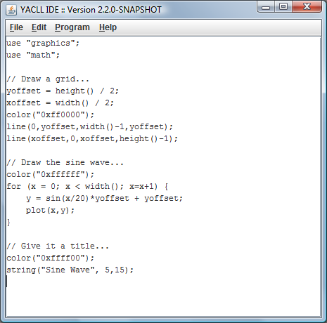
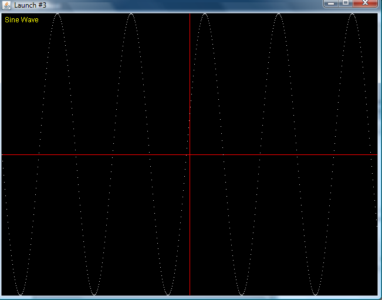
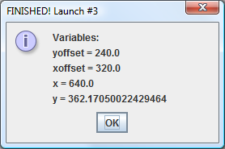
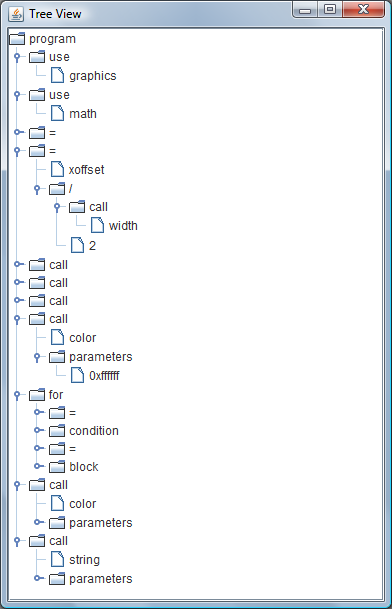

# Overview

YACLL (Yet Another C-Like Language) is some early experimentation with ANTLR v2.
C syntax is simply used for familiarity.

# Code samples

There are a number of samples in the [samples](doc/samples) folder.

The libraries are available in the [resources](src/main/resources) folder.

# "Development Tool" Screen Shots

The YACLL "IDE" is a small persnickety editor (hint: use the menu to paste if you get duplicates).

 

When you run a program, it both draws in its own screen...

... but it also displays all variables and the ending value:

For those interested in the AST generated, that is also available:

# Build

Note that as part of migrating this into GitHub, Maven was added for dependency management as well as building.

It is very likely that, with these antiquated tools, `mvn generate-sources` needs to be executed to generate the ANTLR-related code.

After that, `mvn package` should build the JAR.  Note that some units currently do not work.
